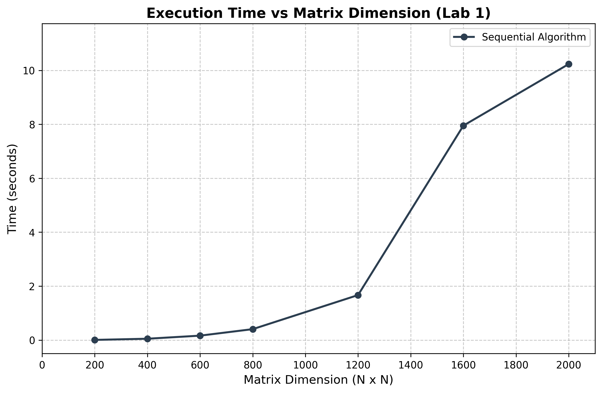

# Лабораторная работа №1: Последовательное умножение матриц

**Студент:** Фадеев Э.И.  
**Группа:** 6311-100503D  
**Зачетная книжка:** 2023-01943  

## 1. Введение
Целью данной работы является реализация базового последовательного алгоритма умножения квадратных матриц на языке C++ и экспериментальный анализ его производительности. Полученные данные станут эталоном (baseline) для оценки эффективности параллельных алгоритмов в последующих работах.

## 2. Краткие теоретические сведения
Операция матричного умножения $C = A \times B$ для квадратных матриц размерности $N \times N$ определяется как:
$$C_{ij} = \sum_{k=0}^{N-1} A_{ik} \cdot B_{kj}$$

Теоретическая временная сложность данного алгоритма — **$O(N^3)$**. Это означает, что при увеличении размерности матрицы в 2 раза, количество вычислительных операций возрастает примерно в 8 раз.

## 3. Описание реализации
*   **Управление памятью:** Использование одномерного динамического массива `std::vector<double>` размером $N^2$ для обеспечения непрерывного размещения данных в памяти. Доступ к элементам осуществляется по формуле `i * N + j`. Это позволяет избежать лишних переходов по указателям и повышает локальность кэша процессора.
*   **Замеры времени:** Использование библиотеки `<chrono>` (`std::chrono::high_resolution_clock`) для точной фиксации времени работы исключительно вычислительного ядра (без учета чтения файлов и сохранения результатов).
*   **Оптимизация компилятора:** Компиляция кода проводилась с флагом максимальной оптимизации скорости выполнения `/O2` в компиляторе MSVC.

## 4. Результаты экспериментов

| Размер матрицы (N) | Время выполнения (сек) |
| :--- | :---: |
| 200 | 0.005340 |
| 400 | 0.048809 |
| 600 | 0.162983 |
| 800 | 0.404315 |
| 1200 | 1.667500 |
| 1600 | 7.951920 |
| 2000 | 10.234400 |

## 5. График зависимости времени от размерности
Ниже представлен график, иллюстрирующий зависимость времени вычислений от размерности матрицы:

## 6. Анализ результатов и выводы
1.  **Подтверждение сложности:** Экспериментальные данные наглядно демонстрируют кубический характер роста времени вычислений ($O(N^3)$), что полностью соответствует теоретической оценке. Например, при увеличении размерности $N$ с 1200 до 2000 (в ~1.66 раза) время вычислений возросло примерно в 6.1 раза (с 1.66 с до 10.23 с). Это близко к теоретическому коэффициенту $(2000/1200)^3 \approx 4.6$ с учетом возрастающих задержек при работе с кэшем и ОЗУ на больших объемах данных.
2.  **Эффективность структуры данных:** Использование одномерного вектора взамен вложенных структур исключает лишние разыменования указателей и подготавливает код к эффективному переносу на технологии параллельного программирования (OpenMP, MPI и CUDA) в последующих лабораторных работах.