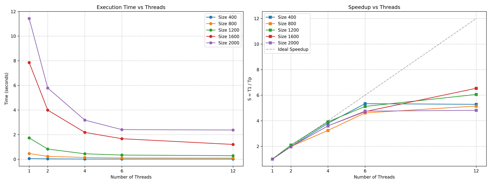

# Лабораторная работа №2: Параллельное умножение матриц (OpenMP)

**Студент:** Фадеев Э.И.  
**Группа:** 6311-100503D  
**Зачетная книжка:** 2023-01943  

## 1. Введение
Целью работы является исследование возможностей многопоточного параллелизма на системах с общей памятью с использованием технологии OpenMP. В рамках работы проведена модификация последовательного алгоритма и измерены показатели эффективности параллельного кода при масштабировании на различной степени загрузки процессора.

## 2. Теоретические сведения
Стандарт OpenMP позволяет распараллеливать итерации циклов между потоками операционной системы. Для оценки эффективности параллельных вычислений используются две основные метрики:
*   **Ускорение (Speedup):** $S_p = T_1 / T_p$, где $T_1$ — время выполнения на 1 потоке, $T_p$ — время на $p$ потоках.
*   **Эффективность (Efficiency):** $E_p = S_p / p$, отражающая долю полезного использования вычислительных мощностей каждым потоком.

## 3. Описание реализации
Распараллеливанию были подвергнуты два внешних цикла перемножения (по строкам $i$ и столбцам $j$). Использование директивы `#pragma omp parallel for collapse(2)` позволяет компилятору объединить итерационное пространство этих циклов в один общий итератор размером $N^2$, который затем оптимально нарезается на блоки для распределения по потокам.
Потоки не конкурируют за запись в результирующий массив (так как каждый поток работает со своими индексами $i$ и $j$), что исключает состояния гонки (race conditions).

## 4. Результаты экспериментов
Испытания проводились на процессоре AMD Ryzen 5 6600H (6 физических ядер, 12 логических потоков). Код скомпилирован с флагами `/O2` и `/openmp`.

### Время выполнения (секунды)
| Размер N | 1 поток | 2 потока | 4 потока | 6 потоков | 12 потоков |
| :--- | :---: | :---: | :---: | :---: | :---: |
| **400** | 0.055992 | 0.028390 | 0.014729 | 0.010495 | 0.010596 |
| **800** | 0.463130 | 0.233293 | 0.142750 | 0.100375 | 0.089942 |
| **1200** | 1.731300 | 0.826179 | 0.442307 | 0.338236 | 0.285856 |
| **1600** | 7.853540 | 3.989410 | 2.182210 | 1.666090 | 1.201120 |
| **2000** | 11.432300 | 5.784520 | 3.177770 | 2.405380 | 2.373570 |

### Полученное ускорение (Speedup)
| Размер N | 2 потока | 4 потока | 6 потоков | 12 потоков |
| :--- | :---: | :---: | :---: | :---: |
| **400** | 1.97x | 3.80x | 5.33x | 5.28x |
| **800** | 1.98x | 3.24x | 4.61x | 5.15x |
| **1200** | 2.10x | 3.91x | 5.12x | 6.06x |
| **1600** | 1.97x | 3.60x | 4.71x | 6.54x |
| **2000** | 1.98x | 3.60x | 4.75x | 4.82x |

## 5. Графики производительности

## 6. Анализ результатов и выводы
1.  **Масштабируемость:** Алгоритм показывает стабильный прирост производительности при увеличении числа ядер. На двух потоках ускорение практически идеально линейно ($\approx 1.98x$).
2.  **Эффективность при росте N:** Наибольшая эффективность распараллеливания достигается на средних и крупных задачах (от 1200 до 1600). Это обусловлено тем, что с увеличением объема вычислений ($O(N^3)$) накладные расходы на создание, синхронизацию и уничтожение потоков становятся незначительными на фоне общего времени работы программы.
3.  **Аппаратные ограничения:** 
    *   При переходе от 6 физических потоков к 12 логическим (технология SMT/Hyper-Threading) темп ускорения замедляется, а на некоторых размерностях (например, N=2000 или N=400) даже наблюдается легкий регресс. Это стандартное поведение для численных методов, так как виртуальные потоки делят физические исполнительные блоки ядра и конкурируют за общую пропускную способность шины оперативной памяти.
    *   Линейный рост ограничен пропускной способностью памяти (Memory Bandwidth), так как перемножение матриц активно работает со сторонними ячейками ОЗУ, нагружая контроллер памяти процессора.