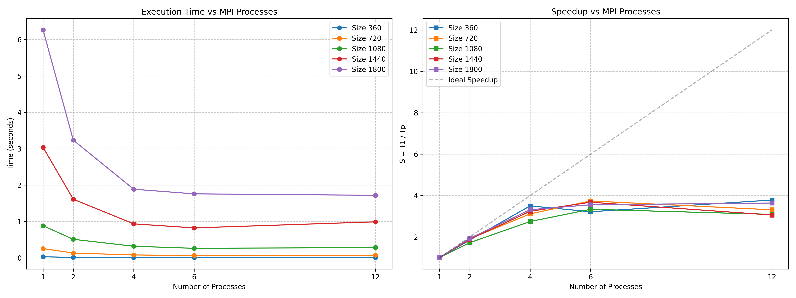

# Лабораторная работа №3: Параллельное умножение матриц (MPI)

**Студент:** Фадеев Э.И.  
**Группа:** 6311-100503D  
**Зачетная книжка:** 2023-01943  

## 1. Введение
Целью работы является изучение принципов параллельного программирования для систем с распределенной памятью с использованием интерфейса передачи сообщений MPI (Message Passing Interface). Реализован параллельный алгоритм перемножения матриц с применением коллективных операций коммуникации.

## 2. Теоретические сведения
В модели MPI программа состоит из независимых процессов со своими изолированными адресными пространствами. Обмен информацией осуществляется через явный вызов функций передачи сообщений.
Использованные в работе коллективные операции:
*   `MPI_Bcast` — широковещательная рассылка данных из корневого процесса всем остальным.
*   `MPI_Scatter` — блочное разделение и рассылка частей массива из корневого процесса по остальным узлам.
*   `MPI_Gather` — сбор отдельных блоков данных со всех процессов в один результирующий массив на корневом процессе.

## 3. Описание реализации
Алгоритм реализует горизонтальную декомпозицию:
1.  **Процесс 0** считывает исходные матрицы.
2.  Размерность матриц рассылается всем процессам через `MPI_Bcast`.
3.  Каждый процесс выделяет память под локальные части данных. Матрица B рассылается целиком на все процессы через `MPI_Bcast`.
4.  Строки матрицы A распределяются блоками (`chunk = size / p_size`) между всеми процессами с помощью функции `MPI_Scatter`.
5.  Каждый процесс параллельно вычисляет свою локальную часть результирующей матрицы C.
6.  Вычисленные строки собираются обратно на Процессе 0 через `MPI_Gather` и сохраняются в файл.

## 4. Результаты экспериментов
Испытания проводились на процессоре AMD Ryzen 5 6600H (6 физических ядер, 12 логических потоков) с использованием Microsoft MPI (MS-MPI).

### Время выполнения (секунды)
| Размер N | 1 процесс | 2 процесса | 4 процесса | 6 процессов | 12 процессов |
| :--- | :---: | :---: | :---: | :---: | :---: |
| **360** | 0.031888 | 0.017229 | 0.009108 | 0.009909 | 0.008427 |
| **720** | 0.257717 | 0.134862 | 0.082728 | 0.068928 | 0.077805 |
| **1080** | 0.885072 | 0.513230 | 0.322234 | 0.265307 | 0.286237 |
| **1440** | 3.038790 | 1.613340 | 0.937441 | 0.826099 | 0.993092 |
| **1800** | 6.263950 | 3.236910 | 1.888730 | 1.761560 | 1.721450 |

### Полученное ускорение (Speedup)
| Размер N | 2 процесса | 4 процесса | 6 процессов | 12 процессов |
| :--- | :---: | :---: | :---: | :---: |
| **360** | 1.85x | 3.50x | 3.22x | 3.78x |
| **720** | 1.91x | 3.11x | 3.74x | 3.31x |
| **1080** | 1.72x | 2.75x | 3.34x | 3.09x |
| **1440** | 1.88x | 3.24x | 3.68x | 3.06x |
| **1800** | 1.94x | 3.32x | 3.56x | 3.64x |

## 5. Графики производительности

## 6. Анализ результатов и выводы
1.  **Коммуникационные затраты:** По сравнению с OpenMP, ускорение в MPI растет медленнее, а на большом числе процессов (12) эффективность падает. Это обусловлено необходимостью явного копирования и пересылки данных в оперативной памяти между адресными пространствами независимых процессов.
2.  **Накладные расходы коммуникаций:** На размерах до 1440 запуск на 12 процессах оказывается медленнее, чем на 6 процессах. Накладные расходы на широковещательную пересылку (`MPI_Bcast`) всей матрицы B размером $N^2$ начинают доминировать над чистым временем вычислений на мелких порциях данных.
3.  **Аппаратные ограничения при локальном запуске:** Так как вычисления проводились на одном физическом ПК, запущенные MPI-процессы активно конкурируют за общую пропускную способность шины оперативной памяти, что накладывает существенные ограничения на масштабируемость алгоритма при локальном тестировании.