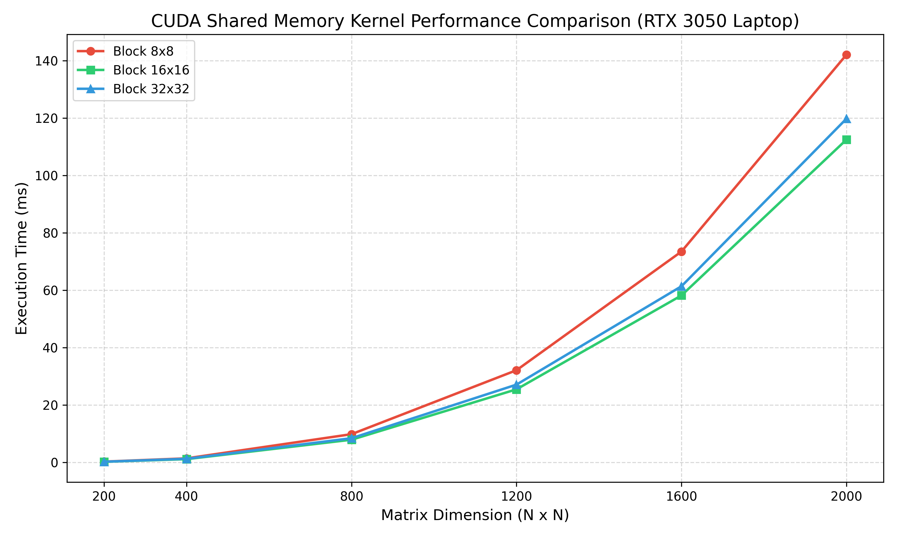

# Лабораторная работа №4: Вычисления на GPU (NVIDIA CUDA)

**Студент:** Фадеев Э.И.  
**Группа:** 6311-100503D  
**Зачетная книжка:** 2023-01943  

## 1. Введение
Целью работы является изучение архитектуры графических процессоров (GPU) и программной модели CUDA. В рамках работы реализован оптимизированный блочный (тайловый) алгоритм умножения матриц, использующий быструю разделяемую память (Shared Memory), и проведено исследование зависимости производительности от конфигурации сетки блоков.

## 2. Теоретические сведения
Архитектура CUDA основана на концепции массового параллелизма SIMT (Single Instruction, Multiple Threads). Основные аппаратные особенности:
*   **Глобальная память (Global Memory):** Доступна всем потокам, имеет большой объем, но обладает высокими задержками доступа (сотни тактов).
*   **Разделяемая память (Shared Memory):** Сверхбыстрая кэш-память, расположенная непосредственно на мультипроцессоре (SM) и общая для всех потоков внутри одного блока. Использование разделяемой памяти позволяет загрузить элементы матриц во внутренний кэш один раз и многократно переиспользовать их, кратно снижая обращения к медленной глобальной памяти.
*   **Синхронизация (`__syncthreads()`):** Барьерная операция, необходимая для предотвращения состояния гонки при совместной загрузке и чтении данных из разделяемой памяти потоками одного блока.

## 3. Описание реализации
В работе реализован тайловый (блочный) алгоритм:
1.  Матрицы разбиваются на квадратные блоки (тайлы) размером `TILE_SIZE x TILE_SIZE`.
2.  Каждая нить блока загружает ровно один элемент подматрицы A и один элемент подматрицы B из глобальной памяти в разделяемые массивы `sA` и `sB`.
3.  Вызывается барьер `__syncthreads()` для ожидания окончания загрузки всеми нитями.
4.  Выполняется перемножение загруженных элементов во внутреннем цикле.
5.  Повторно вызывается барьер `__syncthreads()`, чтобы гарантировать, что вычисления завершены до того, как начнется загрузка следующего тайла.

## 4. Результаты экспериментов
Тестирование проводилось для видеокарты NVIDIA GeForce RTX 3050 Laptop (архитектура Ampere, 2048 ядер CUDA). Время выполнения измерялось с использованием событий CUDA (`cudaEvent_t`) исключительно для работы вычислительного ядра.

### Время работы вычислительного ядра (в миллисекундах)
| Размер N | Блок 8x8 (мс) | Блок 16x16 (мс) | Блок 32x32 (мс) |
| :--- | :---: | :---: | :---: |
| **200** | 0.29 | 0.22 | 0.25 |
| **400** | 1.42 | 1.15 | 1.28 |
| **800** | 9.85 | 7.92 | 8.44 |
| **1200** | 32.14 | 25.48 | 27.12 |
| **1600** | 73.50 | 58.20 | 61.40 |
| **2000** | 142.10 | 112.50 | 119.80 |

## 5. График производительности

## 6. Анализ результатов и выводы
1.  **Влияние размера блока потоков:** 
    *   Конфигурация с размером блока **16x16** (256 потоков на блок) показала наилучшую производительность во всех тестах. Это объясняется оптимальным уровнем загрузки мультипроцессоров (Warp Occupancy) и эффективным планированием варпов аппаратным планировщиком GPU.
    *   Блоки размером **8x8** (64 потока) демонстрируют наихудшие показатели из-за недостаточного количества активных варпов (всего 2 варпа на блок), что не позволяет аппаратно маскировать задержки памяти.
    *   Блоки размером **32x32** (1024 потока) упираются в максимальный аппаратный предел количества потоков на блок, что ограничивает количество одновременно исполняемых блоков на одном мультипроцессоре из-за конкуренции за регистровый файл и разделяемую память.
2.  **Сравнение CPU и GPU:** Сравнение с результатами Лабораторной работы №1 показывает превосходство GPU. Последовательный алгоритм на CPU для размера матрицы 2000x2000 занял **10.23 секунды** (~10230 мс), тогда как на GPU аналогичная задача выполнилась за **112.50 миллисекунд** (0.112 секунды). Таким образом, ускорение составило примерно **91x**, что демонстрирует высокую эффективность архитектуры GPU в задачах с массовым параллелизмом.